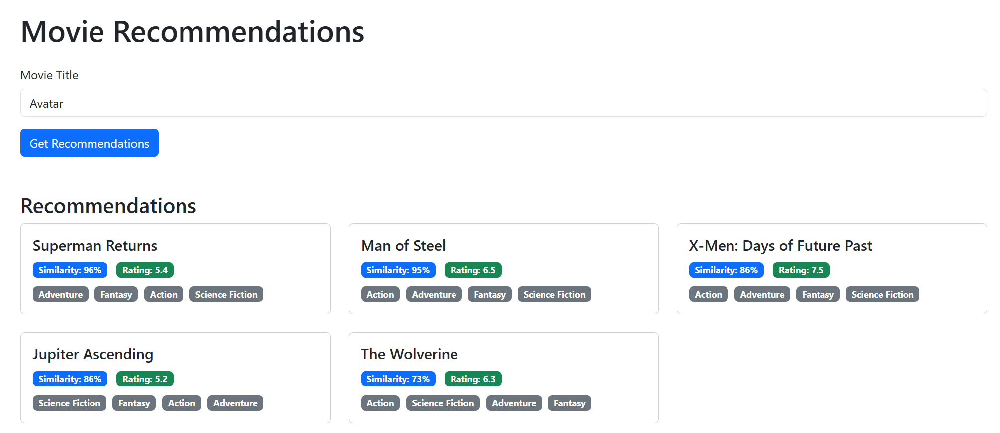

Пример работы приложения для получения рекомендаций по фильму "Avatar"
<p align="center">
 
</p>

### Структура проекта
```python
movie-recommendation-system/
├── front/ # Flask фронтенд-приложение
│ ├── app/ # Основной модуль Flask
│ │ ├── templates/ # HTML шаблоны
│ │ │ └── index.html # Главная страница
│ │ ├── init.py # Инициализация приложения
│ │ ├── routes.py # Маршруты Flask
│ │ └── services.py # Клиент для работы с API
│ ├── requirements.txt # Зависимости Python
│ └── run.py # Точка входа Flask
│
└── service/ # FastAPI бэкенд-сервис
  ├── app/ # Основной модуль API
  │ ├── init.py # Инициализация
  │ ├── config.py # Конфигурация
  │ ├── main.py # Основные endpoint'ы API
  │ ├── models.py # Модели данных
  │ ├── schemas.py # Pydantic схемы
  │ └── services.py # Логика рекомендаций
  ├── data/ # Данные 
  ├── requirements.txt # Зависимости Python
  └── run.py # Точка входа FastAPI
```

### Запуск приложения

#### Front

```bash
cd service
pip install -r requirements.txt
python run.py
```
API доступно на `http://localhost:8000`

#### Backend

```bash
cd front
pip install -r requirements.txt
python run.py
```
Интерфейс доступен на http://localhost:5000